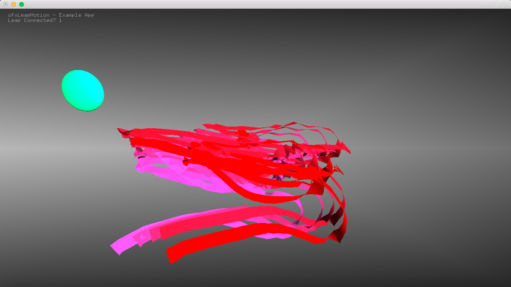

# Leap Motion Group Project

In this project, we designed our leap motion based on the example from online, which is drawing more mechanical lines that hands created. We upgraded the project to a thicker line, colorful line and a ball representing the hand! 

Bascic theory is that leap motion will detect the hands, and trace the lines that the fingures created. We have pink colors for one had, and if you use two hands, and then the second hand will have a blue series color. So you can create something very interesting and artistic with your bare hands. 

The green ball will represent your hand/palm. So you can keep track of where your palms as well. 

Here is a sample photo of what the program looks like:

